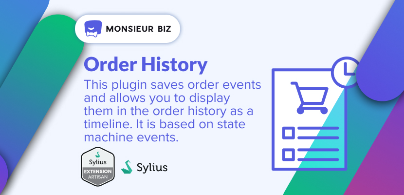
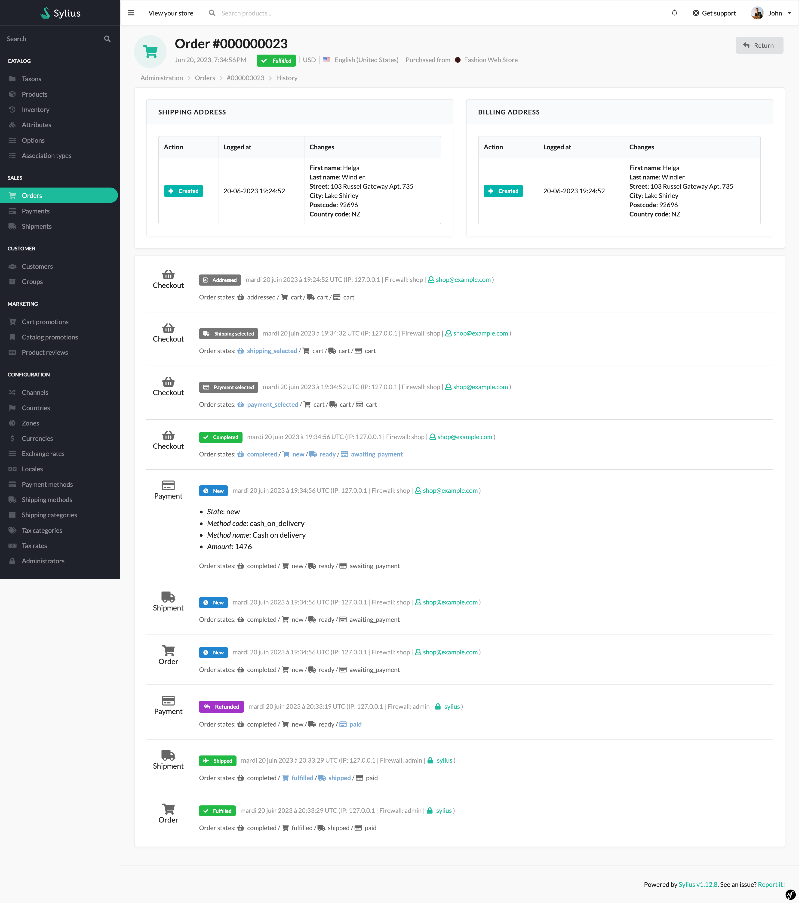

[](https://monsieurbiz.com/agence-web-experte-sylius)

<h1 align="center">Order History for Sylius</h1>

[](https://github.com/monsieurbiz/SyliusOrderHistoryPlugin/blob/master/LICENSE)
[](https://github.com/monsieurbiz/SyliusOrderHistoryPlugin/actions?query=workflow%3ATests)
[](https://github.com/monsieurbiz/SyliusOrderHistoryPlugin/actions?query=workflow%3ASecurity)

This plugin saves order events and allows you to display them in the order history as a timeline. It is based on state
machine events.



## Installation

Install the plugin via composer:

```bash
composer require monsieurbiz/sylius-order-history-plugin
```

### For the installation without flex, follow these additional steps

Change your `config/bundles.php` file to add this line for the plugin declaration:

```php
<?php

return [
    //..
    MonsieurBiz\SyliusOrderHistoryPlugin\MonsieurBizSyliusOrderHistoryPlugin::class => ['all' => true],
];
```

Copy the plugin configuration files in your `config` folder:

```bash
cp -Rv vendor/monsieurbiz/sylius-order-history-plugin/recipes/1.0/config/ config
```

### Doctrine migration

In order to create dedicated tables for the plugin, don't forget to execute doctrine migration commands:

```bash
bin/console doctrine:migrations:migrate
```

## Getting started

Show any order on the Sylius backend and click on the top right `History` button.

## How does it work?

This plugin is based on the state machine events. It uses the native Winzou state machine callback system to save named 
order events when they are triggered. 

```yaml
# src/Resources/config/state_machine/checkout.yaml
winzou_state_machine:
  sylius_order_checkout:
    callbacks:
      after:
        monsieur_biz_order_history_notify_address:
          on: 'address'
          do: [ '@MonsieurBiz\SyliusOrderHistoryPlugin\Notifier\OrderHistoryWithAddressesDataNotifier', 'notifyEvent' ]
          args: [ 'object', 'constant("MonsieurBiz\\SyliusOrderHistoryPlugin\\Entity\\OrderHistoryEventInterface::TYPE_CHECKOUT")', '"addressed"' ]
```

Callback dedicated notifier service / actions who add different details following context:
* `\MonsieurBiz\SyliusOrderHistoryPlugin\Notifier\OrderHistoryNotifier` is a basic notifier with no particular details 
    except the given ones as parameters.
* `\MonsieurBiz\SyliusOrderHistoryPlugin\Notifier\OrderHistoryWithAddressesDataNotifier` is a notifier dedicated to
  address events. It adds the billing and shipping address data.
* `\MonsieurBiz\SyliusOrderHistoryPlugin\Notifier\ShipmentOrderHistoryNotifier` is a notifier dedicated to shipment
  events. It adds the shipment method name and the shipment state.
* `\MonsieurBiz\SyliusOrderHistoryPlugin\Notifier\PaymentOrderHistoryNotifier` is a notifier dedicated to payment 
    events. It adds the payment method name and the payment state.

## How to

* [Add more details on existing events](https://github.com/monsieurbiz/SyliusOrderHistoryPlugin/blob/master/docs/HOW-TO.md#add-more-details-on-existing-events)
* [Add custom event in code](https://github.com/monsieurbiz/SyliusOrderHistoryPlugin/blob/master/docs/HOW-TO.md#add-more-details-on-existing-events)
* [Add custom event in state machine](https://github.com/monsieurbiz/SyliusOrderHistoryPlugin/blob/master/docs/HOW-TO.md#add-more-details-on-existing-events)
* [Add custom type and label display in history timeline](https://github.com/monsieurbiz/SyliusOrderHistoryPlugin/blob/master/docs/HOW-TO.md#add-more-details-on-existing-events)

## Contributing

You can find a way to run the plugin without effort in the file [DEVELOPMENT.md](./DEVELOPMENT.md).

Then you can open an issue or a Pull Request if you want! 😘  
Thank you!

## License

This plugin is completely free and released under the [MIT License](https://github.com/monsieurbiz/SyliusOrderHistoryPlugin/blob/master/LICENSE).
